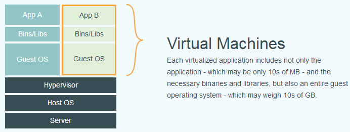

### 云计算概述

- 云计算的原理

- 典型服务器*3

- 大型主流计算平台分析

- 虚拟机 概念 原理 分类

- 容器技术

- 云存储

- 重复数据删除

- HDFS文件系统的构造和使用(存储)

- MapReduce编程(计算)

### 云计算总体架构及实现技术．

#### 开源云计算平台:

hadoop

openstack

#### 谷歌云平台:

google云计算应用

mapreduce(分布式计算框架) bigtable chubby(分布式锁管理器)

GFS

#####　google文件系统:

client(客户端)

master(主服务器)

chunk server(数据块服务器)

系统节点.

###### 设计理念:

- 文件用块储存

  - 每个块固定为64mb

- 通过冗余解决可靠性问题

  - 每个块同时拷贝在三个块服务器上

- 主服务器负责协调访问和保存元数据

  - 简单化的集中管理

- 定制化的API

- 无数据缓存

##### mapreduce分布式数据处理

##### 分布式锁服务chubby

粗粒度锁服务的一个文件系统,大规模,松耦合分布式应用.解决分布式应用的一致性问题.

存储系统 名字服务(name server)

解决方法:

一致性算法: paxos

- 每个应用都会维护一个master的IP地址,通过算法来确保该地址的一致性

- 算法复杂,且和程序耦合紧密

- 由分布式应用参与投票,有个数的要求.

google解决方法:

- chubby

##### bigtable非关系型数据库

性能方面和容量方面的水平扩展功能.

#### hadoop

山寨google.

### 云计算,处理大数据

#### 定义:

云计算是一种商业计算模型,它将计算任务分布在大量计算机构成的资源池上,使各种应用系统能够根据需要获得计算力,存储空间和信息服务

/云计算是通过网络按需提供可动态伸缩的廉价计算服务

#### 大数据:

​    大量数据超出了数据库管理,,能力

#### 云计算特点:

​    超大规模,虚拟化,高可靠性,通用性,可伸缩,按需服务,及其廉价.

#### 结构:

云客户端,云应用,云平台,云基础设施.

#### 设施平台:

IaaS(基础架构层) 提供给消费者的服务器是对所有设施的利用,包括处理,存储,网络,和其他基本的计算资源,用户能够部署和运行任意软件,包括操作系统和应用程序.消费者不管理或控制任何云计算基础设施,但能够控制操作系统的选择,储存空间,部署的应用,也有可能获得有限制的网络组件(如防火墙,负载均衡器等)的控制.

PaaS (平台层)提供给消费者的服务是把客户采用提供的开发语言和工具(如Java  python .net等)开发的或收购的应用程序部署到供应商的云计算基础设施上去.客户不需要管理或者控制底层的云基础设施,但客户能控制部署的应用程序,也可以控制运行应用程序的托管环境配置.

SaaS(软件服务层) 提供给客户的服务是运营商运行在云计算基础设施上的应用程序,用户可以在各种设备上通过瘦客户端界面访问,如浏览器,消费者不需要管理或者控制任何云计算基础设施,包括网络,服务器,操作系统,存储等.

#### 网络计算机的发展:

1.网络就是计算机

2.客户服务计算

3.分布计算中间件

4.集群计算

5.对等计算

6.网格计算

7.服务计算

8.云计算


### 存储技术

#### 储存介质

sdcard , DVD , 磁盘 , U盘 , 软盘 , 磁带 .
(颠覆式创新)

#### 存储接口

哪些 :

- sata

- ide

- usb

- pci

- pcie

- sas

- 光纤通道.

#### 存储系统

##### 金字塔型储存(成本)

##### 存储结构发展里程碑

1. 磁盘阵列RAID:

   分块，交叉存取，以及冗余容错等技术集成大量廉价的小型磁盘储存器构造出磁盘阵列．

2. 附网储存NAS

3. 存储区域网络SAN

4. 面向对象存储(一部分(管理)数据放到服务器)

#### 云存储技术

### 网络计算

#### 什么是网络计算

1. 并行计算

   指同时使用多种计算资源解决计算题的过程.主要解决大型复杂的计算问题

2. 分布计算

   主要研究通过计算机网络....

3. 集群计算

   是指计算集群将一组松散集成的计算机软件或者硬件连接起来高度紧密的协作完成计算工作

4. 网格计算

   通过利用大量异构计算机的未用资源,将其作为嵌入在分布式基础设施中的一个虚拟的计算机集群,未解决大规模的计算问题提供一个模型.

定义:通过网络连接起来的各种资源和系统集成组合起来,以实现资源共享,协同工作和联合计算,为用户提供基于网络资源的联合服务.

#### 网络计算定律有哪些?

1. 摩尔定律

   集成程度一年半提升一倍,性能提升一倍.

2. 吉尔德定律

   网络带宽每隔六个月翻一番

3. 梅特卡夫定律

   网络价值是网络节点数的平方

4. 贝尔定律

   如果保持计算机能力不变，每18个月微处理器的价格和体积减少一半

### 虚拟化

- 程序设计语言

- 操作系统

- 系统虚拟化

- 存储虚拟化

- ......

#### 虚拟化的概念和分类

##### 计算机科学的两种基本思想

hashing
 indirection : visualization introduces one level of indirection between logical and physical size.

##### 定义:

​ 虚拟化是**表示计算机资源的抽象方法**.可用于访问抽象前资源一致的方法访问抽象后的资源.这种资源的抽象方法并不受实现方式,地理位置或底层资源的物理配置的限制.(wiki)

​ 虚拟化是对一组类似资源提供一个通用的抽象接口集,从而隐藏属性和操作之间的差异,并允许通过一种通用的方式来查看并维护资源.

初级到高级,去耦合的过程.

##### 优势

- 隔离化

- 抽象

##### 分类

- 服务器虚拟化

  ​ 一台服务器变成多台服务器

- 桌面虚拟化

  ​ 提供易管理,移动,安全的桌面环境.

- 存储虚拟化

  ​ 整合容量 提高性能 提供高级功能

- 网络虚拟化

  ​ 整合不同网络环境 提供虚拟化网络平台

- 应用虚拟化

  ​ 仿真 模拟 解析

##### 虚拟化和云计算

层级:

SOA体系结构

管理中间件

资源虚拟化

物理资源

#### 服务器虚拟化

产生背景:

服务器系统利用率不高

传统计算机系统的灵活性不高

名词:

虚拟机管理器(virtual machine monitor)

徐虚拟机(virtual machine)

客户操作系统(guest OS)

特性:

分区 , 隔离 , 封装.

共享和隔离

动态构建

​ 动态的对物理硬件和虚拟操作系统添加和删除.

动态快速部署

服务器融合(消除热点,节能)

X86体系不兼容虚拟化

全虚拟化

半虚拟化(父虚拟机->子虚拟机)

​ 优点:性能能达到与原始系统相近的性能,缺点:需要修改guest os

硬件虚拟化

#### 桌面虚拟化

​ 是指将计算机的桌面进行虚拟化,已达到桌面使用的安全性和灵活性,可以通过任何设备,在任何地方,任何时间访问在网络上的属于我们个人的桌面系统.(没有磁盘的系统)

#### 存储虚拟化

​ 在物理存储系统和服务器之间增加一个虚拟层,它管理和控制所有存储兵对服务器提供存储服务.

###　网络虚拟化

整合各种网络．

为服务器虚拟机提供虚拟机感知的以太网络

### 容器技术

linux container

通过虚拟化操作系统的方式来管理代码和应用程序

容器是操作系统内核和自带能力.

虚拟机是操作系统级别的资源隔离.

docker统一镜像格式.

基于内核namespace技术，对现有基础设施侵入较少．

#### 容器的崛起

厂商中立联合协议




docker 基本原理　

```shell
docker pull //pull images 

docker run 

docker build

docker push
```

docker 缺点:

1. 安全性有限.

2. 缺少容器资源管理的保护.

3. 主要支持linux.

4. 命令行界面.
