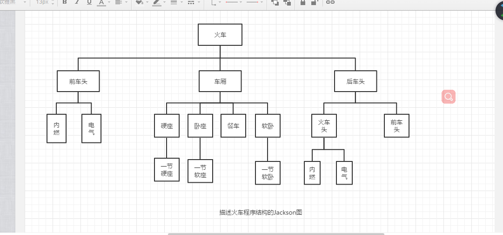

# 模型

## 快速模型:

快速开发软件样机,让用户试用,及时征求用户意见.

## V模型:

用来描述测试,将测试阶段细化.

## 增量模型:

大系统中有若干子系统.

能够较短时间内向用户完成部分工作的产品,使用户有较充裕的时间学习和适应新产品

工作量大,集成难度大.

### 风险更大的增量模型

构建无法集成的风险.

## 螺旋模型

使用原型及其他方法来尽量降低风险.
特点: 瀑布模型+快速模型+增量模型

## 其他模型

### 喷泉模型

面向对象软件过程模型之一,迭代 ,无缝.

### 敏捷过程

极限编程,用于需求模糊且经常改变的场合

# 可行性研究

一.可行性研究的任务

是否能有效解决.
目的是确定问题是否能够解决
压缩简化了系统分析和设计的过程,也就是在较高层次上以教抽象的方式进行的系统分析和设计过程.

任务: 进一步确认问题定义->导出系统的逻辑模型->探索一种系统是哪方案->研究每种方案的可行性->系统目标和规模是否现实->效益是否达到最大值.

三个方面可行性

1. 技术可行性

   系统技术难点 硬件要求 系统开发和现有系统的矛盾.

2. 经济可行性

3. 操作可行性

## 二.可行性研究过程

1. 复查系统规模和目标
2. 研究目前正在使用的系统
3. 导出新系统的高层逻辑模型
4. 进一步定义问题
5. 导出和评价供选择的方法
6. 推介行动方针
7. 草拟开发计划
8. 书写文档提交审查

## 三.系统流程图

概括描绘物理系统的传统工具,基本思想是用图形符号以黑盒子的形式描绘组成系统的每个部件.

表达的是数据在各个部件之间的流动情况.    

分层...

## 四.数据流图

数据流图(DFD)

1. 正方形表示数据的原点和终点
2. 圆角矩形代表数据的处理
3. 开口矩形代表数据存储
4. 箭头表示数据流,即特定数据的流动方向

### 一般步骤

从问题描述中提取数据流图的四中成分
画出基本系统

# 需求分析

## 需求验证一般从哪几个方面进行?

- 一致性
- 完整性
- 现实性
- 有效性

## 需求功能一般分为需求开发和需求管理

需求管理包括三部分：

- 变更控制
- 版本控制
- 需求跟踪

## 需求建模

ERD

DFD

STD

# 面向对象编程

## 从结构化到面向对象

1. 传统范型不能适应规模越来越大的软件产品开发
2. 传统范型在维护方面不能满足人们的期望

## 面向对象方法学概述

object-oriented software development OOSD 

分析问题的步骤:面向过程

分析系统的实体:面向对象

主要优点: 

1. 与人类思维一致
2. 稳定性好
3. 可重用性好
4. 较易开发大型软件产品
5. 可维护性好

## 面向对象建模

统一建模语言.

通常建立三种形式的模型:

1. 描述系统数据结构的对象模型(类图)
2. 描述系统控制结构的动态模型
3. 描述系统功能的功能模型

#### 对象模型

表示静态的,结构化的系统数据性质.他是对模拟客户端世界实体的对象及对象彼此间的关系(类图) 

#### 动态模型

表示变化的系统的功能性质,状态转换

#### 功能模型

数据流tu,用例图

## 面向对象分析

获取用户基本需求

标识类和对象

定义类的结构和层次

建立类(对象)之间的关系

为对象行为建模

#### 用例建模过程

#### 数据流图

## 结构化设计

什么是结构化设计

黑盒级物理元素

#### 设计过程

#### 系统设计阶段,确定系统设计方案

#### 结构设计阶段

#### 模块化

模块化尺度

#### 逐步求精

#### 信息隐藏和局部化

#### 模块独立

标准:

耦合:衡量**不同模块**彼此间互相依赖的紧密程度.(低好)

内聚:衡量一个**模块内部**各个元素彼此结合的紧密元素.(高好)

# 详细设计概述与方法

## 结构程序设计

什么是:顺序,分支,循环...

## 人机界面设计

## 过程设计工具

### 图形工具

程序流程图

盒图

pad图

### 表格工具

判定表

判定树

### 语言工具

过程设计语言(PDL)又称伪代码.

## 面向数据结构的设计方法

jackson图

一条条代码的位置.

## 程序复杂程度的定量度量

环形复杂度

McCabe

代码行度量法

Halstead方法

# 面向对象设计与UML建模方法

## 一.面向对象设计的准则

1. 强内聚
2. 可重用

## 二.启发规则

...

## 三.系统分解

...

## 四.UML概述

...

## 五...

## 六.Rational

## 七,对结构建模

## 八对行为建模

## 九.对体系建模

# 编码和软件测试基础

### 编码风格

# 软件测试

## 测试方法划分

### 黑盒测试 

#### 等价类划分法

#### 边界值划分法

- 较好的测试回报
- 方法较为简单,但仅限于观察正处于等价划分边界或在边界附近的状态.

#### 错误推测

###  白盒测试

#### 逻辑覆盖方法

语句覆盖: 每个语句

条件覆盖: 分支

判定覆盖: 分支里的每个条件

条件组合

## 级别划分的测试:

### 单元测试,

针对软件测试的最小单位

白盒方式 , 

着重5个方面对模块进行测试

- 模块借口
- 局部数据结构
- 重要的执行通路
- 出错处理通路 
- 边界条件

### 集成测试

一次性组装方式

渐增式

### 验收测试

系统级

回归测试---新版本.影响域

# 维护

> 软件维护的最后一个阶段

## 一什么是软件维护?

在软件产品被开发出来并交互用户使用之后,就进入了软件的运行维护阶段

+ 最后一个阶段
+ 维护成本工作量非常大,一般为开发的4倍左右
+ 目前国外的组织把60%的人用于已有软件的维护.
+ 软件工程的一个主要目的是提高软件的可维护性.

## 划分

1. 改正性维护

   1. 软件的错误
2. 适应性维护

   1. 外部环境的改变
3. 完善性维护

   1. 增加新功能:最寻常的维护.
4. 预防性维护

## 软件维护的过程

## 软件的可维护性

​	 纠正软件系统出现的错误,以及为满足新的要求进行修改,扩充或者压缩的成本.	

### 七个指标度量软件的可维护性

1. 克里就行
2. 可靠性
3. 可测试性
4. 可修改性
5. 可移植性
6. 效率
7. 可使用性

### 提高可维护性

​	软件工程...

# 软件项目管理

### 一.软件项目管理

#### 过程定义与剪裁

如何规范项目开发过程

#### 软件项目计划

如何合理安排工作计划

#### 软件度量

如何合理控制成本和时间

#### 软件项目的跟踪与监督

如何确保项目按计划完成

#### 风险控制

如何处理项目中遇到的意外事件

#### 软件需求管理

如何保证开发的软件系统满足用户要求

#### 软件质量保证

如何保证所开发的软件系统的质量

#### 软件配置管理

如何管理开发出来的产品

#### 软件项目团队管理

如何让手下的人员充满激情的工作.

## 二.估算软件规模

1. 代码行技术
2. 功能点技术

## 三.工作量估算

1. 静态单变量模型
2.  
3. COCOMO2模型(构造性成本模型)

